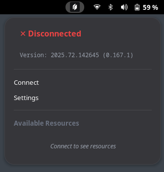

# Twingate status icon
This Gnome Shell extension shows a status icon on the Gnome top bar indicating Twingate's connection status.
Clicking on the menu entry starts or stops the connection.



## Features

- **Multi-state indicator**: Displays connection status with three states:
  - ✓ **Online** (green): Connected to Twingate
  - ⟳ **Authenticating** (yellow): Authentication in progress
  - ✕ **Not Running** (red): Disconnected

- **Multi-language support**: Available in 7 languages with automatic detection from system locale:
  - 🇬🇧 English (default)
  - 🇫🇷 Français
  - 🇪🇸 Español
  - 🇩🇪 Deutsch
  - 🇮🇹 Italiano
  - 🇵🇹 Português
  - 🇳🇱 Nederlands

- **Resource list**: View available Twingate resources directly from the menu when connected

- **Settings panel**: Configure Twingate settings through a graphical interface:
  - Autostart on boot
  - Save authentication data
  - Sentry error reporting consent
  - Log level (debug, info, warn, error)

- **Extension preferences**: Customize the extension behavior:
  - **Language selection**: Choose your preferred language or use automatic detection
  - **Resource refresh interval**: Adjust how often the resource list updates (30-600 seconds)

- **Version display**: Shows the installed Twingate version in the menu

## Requirements
Twingate for Linux should be installed before this extension. Your system should use Systemd (or have a `systemctl` shim).

## Compatibility
Tested working on Arch/Manjaro and GNOME Shell 46-49.

This extension calls the following commands. If these don't work when you run them manually the extension won't be able to change the connection status.

```shell
# Check status
twingate status

# Stop connection
systemctl stop twingate
systemctl stop --user twingate-desktop-notifier
```

```shell
# Start connection
systemctl start twingate
systemctl start --user twingate-desktop-notifier
```

```shell
# View configuration
twingate config

# Modify configuration (requires sudo)
sudo twingate config autostart true
```

## Installation

1. Clone this repository or download the extension
2. Run the installation script:
   ```bash
   ./install.sh
   ```
3. Restart GNOME Shell (Alt+F2, type 'r', press Enter on X11 or logout/login on Wayland)
4. Enable the extension using GNOME Extensions app or:
   ```bash
   gnome-extensions enable twingate-status@eudes.es
   ```

## Configuration

Access the extension settings by clicking on the menu and selecting "Settings".

### Twingate Settings
From the Twingate configuration section, you can modify:
- **Autostart**: Enable/disable automatic start on boot
- **Save Auth Data**: Keep authentication data between sessions
- **Sentry User Consent**: Allow error reporting
- **Log Level**: Adjust logging verbosity (debug, info, warn, error)

Note: These settings require administrator privileges (using `pkexec`) to modify the Twingate configuration.

### Extension Preferences
- **Language**: Choose your preferred language (auto-detection or manual selection from 7 languages)
- **Resource Refresh Interval**: Set update frequency when connected (30-600 seconds, default: 120)

Changes to language settings require a GNOME Shell restart (Alt+F2, type 'r' on X11 or logout/login on Wayland).

## Localization

The extension supports 7 languages with automatic system detection or manual selection:
- 🇬🇧 English (default) • 🇫🇷 Français • 🇪🇸 Español • 🇩🇪 Deutsch • 🇮🇹 Italiano • 🇵🇹 Português • 🇳🇱 Nederlands

To add more languages, edit the `locale.js` file and add your translations to the `TRANSLATIONS` object.

## Development

The extension is built with:
- GNOME Shell Extension APIs
- GJS (GNOME JavaScript)
- GTK 4 / libadwaita (for settings)

File structure:
- `extension.js` - Main extension code
- `prefs.js` - Settings/preferences panel
- `locale.js` - Translation system
- `stylesheet.css` - UI styling
- `metadata.json` - Extension metadata
- `schemas/` - GSettings schemas for extension preferences

### Debug Logging

The extension includes debug logging. To view logs:
```bash
journalctl -f -o cat /usr/bin/gnome-shell | grep -i twingate
```

## Troubleshooting

### Extension not loading
1. Check that GNOME Shell version is 46-49
2. Ensure Twingate is installed: `which twingate`
3. Verify schema compilation: `ls ~/.local/share/gnome-shell/extensions/twingate-status@eudes.es/schemas/gschemas.compiled`
4. Check logs: `journalctl -f -o cat /usr/bin/gnome-shell | grep -i twingate`

### Settings not loading
The settings require root privileges. Make sure `pkexec` is installed and working:
```bash
pkexec twingate config
```

### Resources not showing
1. Verify you're connected: `twingate status`
2. Check resources exist: `twingate resources`
3. Adjust refresh interval in preferences if needed

## License

LGPL-3.0-or-later

## Credits

Original extension by [eudes](https://github.com/eudes)
Enhanced with multi-state support, i18n (7 languages), settings panel, and resource list
